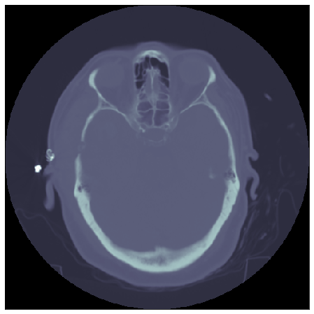
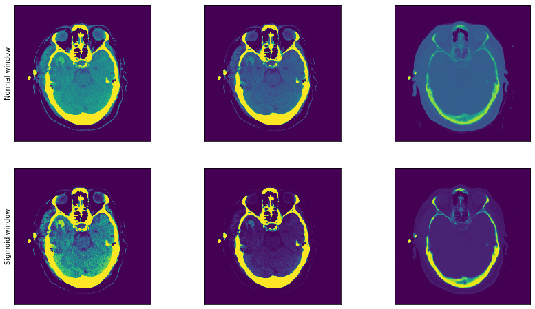

# Kaggle - RSNA Intracranial Hemorrhage Detection

Multiclass classification of acute intracranial hemorrhage and its subtypes in  brain CT.

  
   (source: https://www.kaggle.com/c/rsna-intracranial-hemorrhage-detection/overview/hemorrhage-types)

Code for Kaggle's [RSNA Intracranial Hemorrhage Detection](https://www.kaggle.com/c/rsna-intracranial-hemorrhage-detection). 
This solution has scored 0.05842 (weighted multi-label logarithmic loss) on private leaderboard and ranked 142nd place (top 11%).

## Description
* PyTorch
* Ensemble of 4 models
    * [EfficientNet B3](https://github.com/lukemelas/EfficientNet-PyTorch) ([conf](src/conf/model_001.py))
    * ResNext101 32x8d wsl ([conf](src/conf/model_002.py))
    * SeResNext50 32x4d ([conf](src/conf/model_005.py))
    * ResNext50 32x4d ([conf](src/conf/model_006.py))
* [Albumentations](https://github.com/albumentations-team/albumentations) augmentations
* Optimizer: [RAdam]( https://github.com/LiyuanLucasLiu/RAdam/blob/master/radam.py)
* Metric: Weighted multi-label logarithmic loss
* Loss: BCEWithLogitsLoss
* Scheduler: MultiStepLR
* Preprocessing: 
    *  Models 1,2,5: Resize to 256x256, extract 3 normal windows (default from metadata [-1, -1], subdural [80, 200], bone [600, 2800]), normalize 0-255
    *  Model 6: Resize to 378x378, extract 3 sigmoid windows (default from metadata [-1, -1], subdural [80, 200], bone [600, 2800]), normalize 0-255
* Test time augmentations: horizontal flip

### Window functions
Extract 3 windows from raw dcm data and use them as RGB layers

|  | |
|:---:|:---:|

- default window from metadata [-1, -1], subdural window [80, 200] bone window [600, 2800]

### Training
Training is done in 3 stages
1. Training on fixed undersampled balanced dataset
2. Training on undersampled balanced dataset where new undersampling is done after each epoch 
3. Training on full unbalanced dataset